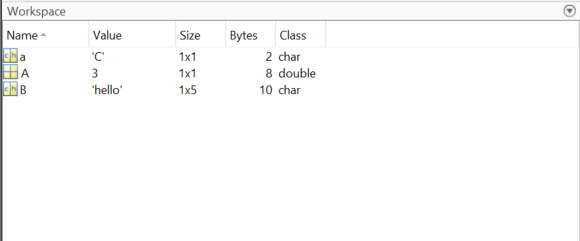
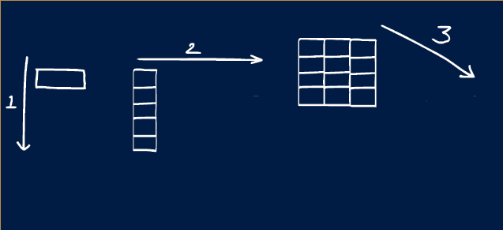

:::::::::::::::::::::::::::::::::::::: questions 

- How can I store and work on data?
- What does MATLAB assume about your data?
- How can I handle data of 2, 3 or more dimensions?

::::::::::::::::::::::::::::::::::::::::::::::::

::::::::::::::::::::::::::::::::::::: objectives

- What is a variable and how MATLAB handles them
- How we can create variables of various dimensions
- Briefly review data types and why they aren't important in MATLAB

::::::::::::::::::::::::::::::::::::::::::::::::

## Introduction

When programming there are many occasions where you will want to be able to access some data, for example you may want to load in a data set from online, load data from an sensor in the field or store the results of a calculation. How we store and refer to data in programming is a variable.


## Variables

A variable in MATLAB is made of 2 parts, a name and a value. The name is what we use to refer to a variable and the value is the number, word, or item that is stored in it. 

The value of a variable in MATLAB can be many things! Some examples are

| Variable Type | Example Value |
|---|---|
|Integer| 1, 2, 3|
|Double| 1.23, 4.56|
|Character| A, b, c|
|String| "hello"|
|Matrix| [1 2 3; 4 5 6]|
|Logical| True, False|


As mentioned in the previous episode, MATLAB has a section called the workspace, this is where you can view what Variables are in-memory. The most simple way of creating a variable is with the '=' symbol, for example:
```
my_variable = 5
```
will create a variable with the name my_variable and a value of 5

::: spoiler
### Memory

MATLAB (like most programming languages), holds variables in-memory. This means they are stored on your computers RAM rather than your hard drive. This allows for fast access and processing, however RAM is wiped when your computer turns off so your workspace will be deleted when you close MATLAB or your computer.
:::

::: challenge
### Challenge 1: Creating Variables
  1. Create a variable called A with a value of 3: `A = 3`
  
  2. Create a variable called B with a value of hello: `B = 'hello'`
  
  3. Create a variable called a with the value of C: `a = 'C'`
  
  4. Customise your workspace and add the extra columns Size, Bytes and Class, this can be done by right clicking the top of the workspace
  
::: solution
  Your workspace should look like this! We suggest customising the workspace columns just as an example of what is possible. 
{alt="A screenshot of the MATLAB workspace with 3 variables in it from the challenge"}
:::
:::
::: spoiler
### Data Types
You may notice in the previous solution there is a type called a 'double'. MATLAB is whats known as a dynamically typed language, which is also called the fun duck typing. This is based off the saying 'if it walks like a duck and quacks like a duck it's probably a duck'. In programming terms this means that when you make a variable MATLAB has a look at it and assumes what type it is based on how it looks. Other languages like C++ require you to explicitly tell the program what type every variable is.

For you as a user, this means that you don't have to really know or pay attention to data types! However it is worth knowing they exist, as if you get more advanced you may want to manipulate them to optimise your algorithms or some other advanced use cases.
:::


## Variable Names

There are several conventions for naming variables, such as camel case, where each word is joined without a space and each new word starts with a capital letter. For example `camelCase` or `analysisResult`

Snake case is another common standard, where each word is lower case and separated with underscores, for example `snake_case` or `analysis_results`. 

Both standards will work well, if you're working with existing code or on an existing project it is normally best to stick with the convention already in use!

::: callout
### Useful Variable Names

In this lesson we are using variable names without any meaning such as A or B. When programming code it is good practice to use meaningful unique names for your variables.

:::

## Dimensions

A lot of data analysis, processing and workflows wont be with single numbers but with large multidimensional datasets. Working with image/video, time series, tables or many other data sources can quickly make your incoming data large in size. Variables in MATLAB can and are very good at storing and working with multidimensional data. 


::: challenge
### Penny command

Use the `penny` command in the command window. this command will create an interactive 3d plot of a US penny mold.

1. How many new variables are there in your work space?
2. Look at the size column in your workspace, how many dimensions are there in each variable?

::: hint

If you double click a variable name in the workspace you can explore it in a spreadsheet style interface, this is called the variable editor.

:::

::: solution

There should be 2 new variables in your workspace, `P` and `D`. Both have a size of 128x128, this means they have 128 rows and 128 columns and therefore are 2 dimensional.

:::

:::

::: callout
### Dimension Order

In MATLAB learning the order in which dimensions appear is very helpful. 

The first dimension is always rows and the second columns. So if you saw a variable with size 5x10, you could picture it looking like a spreadsheet with 5 rows and 10 columns.
:::


In MATLAB there are names given to different variable shapes:

| Dimensions | Name | Description |
|---|---|---|
| 0D | Scalar | A single value like those created in Challenge #1|
| 1D | Vector | A single row or column |
| 2D | Matrix | Rows and columns, like an Excel spreedsheet or Google sheet |
| 3D+ | Array | Rows, columns and pages |

{alt="An animated GIF showing a vector column, matrix and array being built. It aims to add intuation for the shape of each of these types"}

### Creating Multidimensional Variables

In general when creating multidimensional variables you 
- use square brackets `[]`
- separate columns with a space ` `
- separate rows with a semi-colon `;`

Here are some examples of creating vector variables:

``` MATLAB
E = [1 2 3] # 1x3 row vector named E 
F = [4;5;6] # 3x1 column vector called F
```
::: challenge

1. Create a row vector called G with values 2, 4 & 6
2. Create a column vector called H with values 1, 3 & 5
3. Create a 2x2 matrix called I with values 10, 20, 30 & 40.

::: solution
1. `G = [2 4 6]`
2. `H = [1;3;5]`
3. `I = [10 20; 30 40]`

:::
:::

## Cleaning Workspace

Finally we will look at how we can remove variables we aren't using! We do this because as you explore data and test your analysis over time you will get variables you aren't building cluttering your workspace, this can lead to you either accidently overwriting data or using variables you weren't intending to.

**Clearing all variables**

Simply putting `clear` into your command window will clear all variables

**Clear single variable**

`clear A` will clear just the variable called A

**Clear command window**
## TODO clearup history
After working a while you will have a long history of commands in your command window, you can clear this up by typing `clc` (command line clear).

::: callout
You can access commands you have previously typed in the command window by pressing the up arrow on your keyboard
:::


## Indexing

### Colon Notation

MATLAB provides what is called the colon notation which allows us to specify a range of values.

``` MATLAB
a = [1:10]
```
``` OUTPUT
a =

     1     2     3     4     5     6     7     8     9    10
```

`a` should be 1x10 size, meaning 1 row 10 columns

### Steps
You can also specify a step, so the colon notation only makes every nth number 

``` MATLAB

b = [1:2:20]

```

``` OUTPUT

b =

     1     3     5     7     9    11    13    15    17    19
```

## Functions

We can also use functions to create arrays. Functions are premade code blocks that serve a commonly wanted functionality.

First we will use one called linspace, which stands for linearly spaced. It creates a vector of linearly spaced numbers, you specify the start, end and how many numbers.

::: callout

If you are ever unsure about a function MATLAB has inbuilt help and documentation!

The help command will give a brief text description about the function and how to use it
``` MATLAB
help linspace
```

The doc command will give a more detailed description including examples
``` MATLAB
doc linspace
```

:::

``` MATLAB

c = linspace(1,10,5)

```

``` OUTPUT

c =

    1.0000    3.2500    5.5000    7.7500   10.0000
    
```

Some other useful functions are:
``` MATLAB
% Rand creates an n-dimensional array of random numberes between 0 and 1.
d = rand(5,1)

% Create matrix of 0's
e = zeros(2,2)

% NaN means 'Not a Number', this is a special and useful term for when a value can't be represented by a number. 
f = nan(5,5)
```
::: callout

Here are some common scenarios where NaN may be used:

- Mathematical operations that cant be computed (division by 0, root of negative numbers)
- No data was recorded, for example a in-field sensor may have lost power

:::

::: challenge

1. Create a vector with numbers 12 to 100 containing every 4th number (steps of 4), call it g
2. Create a matrix of random numbers with 4 rows and 5 columns, call it h

::: solution
``` MATLAB
g = 12:4:100
or
g = linspace(12,100,23)
```
:::

:::


::::::::::::::::::::::::::::::::::::: keypoints 

- Variables are the main way we access and use data in MATLAB
- Variables can store many types of data including multidimensional data
- Creating multidimensional arrays is done with square brackets

::::::::::::::::::::::::::::::::::::::::::::::::

