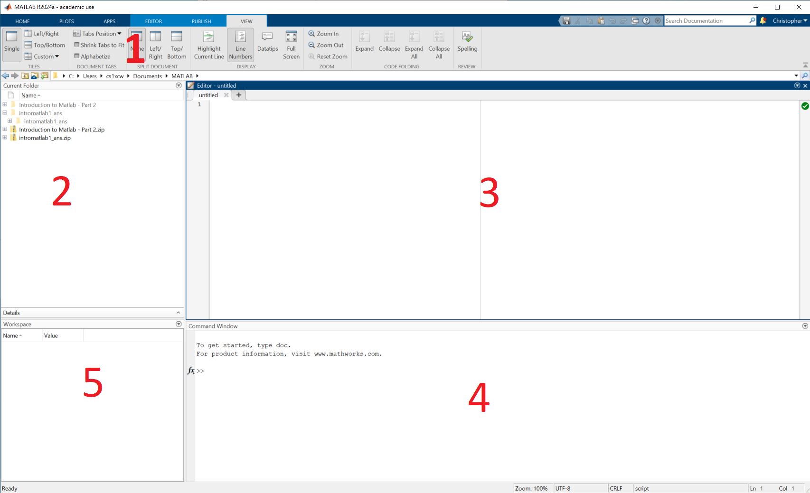

:::::::::::::::::::::::::::::::::::::: questions 

- What do all the different parts of the MATLAB interface do?
- What features are important to get started in MATLAB?

::::::::::::::::::::::::::::::::::::::::::::::::

::::::::::::::::::::::::::::::::::::: objectives

- Learn to navigate and adjust the MATLAB interface
- Understand the difference between the command window and the editor

::::::::::::::::::::::::::::::::::::::::::::::::

## Introduction

MATLAB as a language is mainly interacted with through the official MATLAB application. Before we press on with learning, writing and running MATLAB this episode will quickly run through the various parts of MATLAB and help you understand where and how you should write MATLAB.

Below is an annotated diagram what of the MATLAB application looks like.

::: callout
### Layout

Don't worry if your layout does not match the one in the diagram. The MATLAB application is very customizable and you can drag and drop the various windows around. There are a few preset layouts available in the view tab at the top 

:::

Each number on the diagram describes:

1. Menu Ribbon - This bar functions much like the bars at the top of many Microsoft and Google applications you may be familiar with, it has tabs with different options in. Throughout this course we will be exploring some of these tabs in more detail.
2. Explorer - Here you can explore the files on your computer much like the explorer on your computer. The folder currently showing is referred to as the 'Current Folder' or 'Working Directory', this is where MATLAB will first search for files.
3. Editor - This is where you will edit MATLAB code files
4. Command Window - One off MATLAB commands can be executed here 
5. Workspace - You will be able to see any variables that are currently in memory here

If any of this isn't clear again don't worry! This course will further explore and clarify all of these tools


{alt="A screenshot of the MATLAB application with red numbers annotating the major areas of the application which are detailed in the main body"}


## Editor VS Command Window

You can write and run MATLAB code in both the command window and the editor so understanding the purpose and differences of them is important.

| Command Window | Editor |
|---|---|
| Quick calculations | Creating and editing persistent scripts |
| Testing | Reading and using others code |
| Interactive exploration | Creating functions |
| Debugging | |


::: challenge
### Challenge 1: Using the command window

What is the output of this command?
```
13 * 8
```
:::

::: instructor

May be worth explaining that '*' is used for multiplication in many programming languages and '/' for divide

:::

::: challenge
### Challenge 2: Using the editor

Press 'New' at the top left and type the following into your editor. Then press 'Run' in the EDITOR tab at the top.

```
b = 136 / 8
```

1. What do you have to do in order for the code to run?
2. What is the output?

::: solution

1. The editor modifies and runs a MATLAB file (m-file), so in order to run what is in the editor you will be required to create and save a file.

2. 17
:::
:::
As you saw in the challenge above, using the editor requires you to create and save a file with the extension `.m`. This means that when you next come to do your analysis, processing, etc. you can reopen this file and work from it again. 

::: callout
### Saving your work

Unlike the editor, any work done in the command window is not saved! This means that if you close MATLAB or your computer this work will be lost. Hence why you should use it only for quick temporary tasks
:::

::::::::::::::::::::::::::::::::::::: keypoints 
- The MATLAB interface is very customisable, adjust it to suit you
- Use the command window for quick tasks like exploring data, testing, etc.
- Use the editor for developing code you want to persist between sessions
::::::::::::::::::::::::::::::::::::::::::::::::

