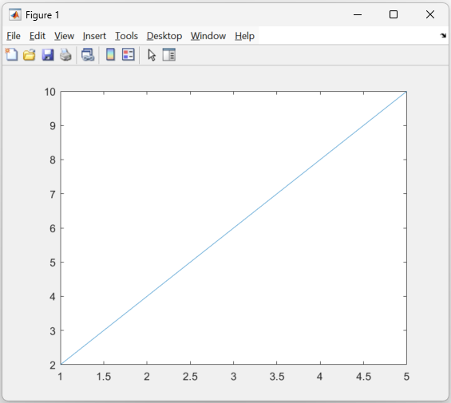
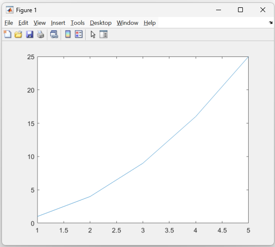
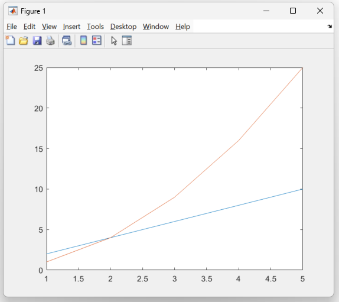
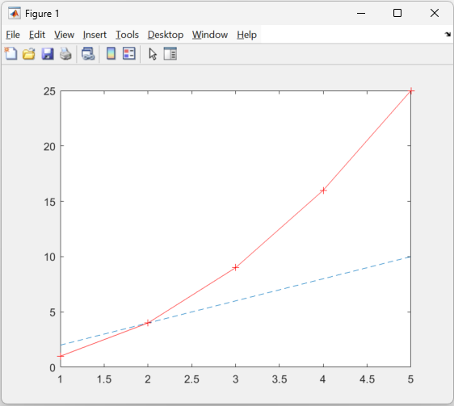

:::::::::::::::::::::::::::::::::::::: questions 

- How can I visualise my data to explore it and gain insights?
- What types of plot does MATLAB support?

::::::::::::::::::::::::::::::::::::::::::::::::

::::::::::::::::::::::::::::::::::::: objectives

- Demonstrate how to create plots in MATLAB that have titles, labelled axis and multiple lines
- Demonstrate how to include pieces of code, figures, and nested challenge blocks

::::::::::::::::::::::::::::::::::::::::::::::::

## Plot Function

MATLAB has an inbuilt function called `plot` that creates 2-D line plots. We will start by exploring how to use this function to get used to
the plotting syntax of MATLAB and how we can explore figures.


### Basic Plot

Create a basic 2D line plot with the following variables

``` MATLAB

x = [1 2 3 4 5];
y1 = [2 4 6 8 10];

plot(x,y1)

```

{alt="A screenshot of a MATLAB figure containing a straight line"}

### hold on

To add another line to the same plot we can use the [hold on](https://uk.mathworks.com/help/matlab/ref/hold.html) command, this will retain the current figure when adding new plots.

::: challenge

## hold on

Create another vector variable called y2 with values 1, 4, 9, 16, 25

1. Plot x against y1 then x against y2 without hold on, what happens?

2. Plot x against y1, then `hold on`, then x against y2, what's different?

::: solution

1. You should only see the y2 line, as the y1 figure was overwritten without `hold on`
{alt="A screenshot of a MATLAB figure containing a curved"}

2. Now you should have both lines on the same plot
{alt="A screenshot of a MATLAB figure containing both a straight and curved line"}

:::
:::

### Line and Marker Styling
MATLAB offers a range of line colours and markers which can help distinguish lines or theme them.

Here are links to the [line style](https://uk.mathworks.com/help/matlab/creating_plots/specify-line-and-marker-appearance-in-plots.html) and [plot colour](https://uk.mathworks.com/help/matlab/creating_plots/specify-plot-colors.html) guides.

::: challenge
## Styled plots

Close any currently open figures and use the guides above to plot the following lines:

1. Plot y1 against x with a dashed line
2. Plot y2 against x using a red solid line with plus markers

::: solution

``` MATLAB

plot(x,y1, '--')
hold on
plot(x,y2, '+-r')

```

{alt="A screenshot of a MATLAB figure containing both a straight and curved line"}
:::
:::
## Figure Labelling

Titles, axis labels and legends are useful tools to make your plots more readable, and are essential to a plot if it is being added to a paper or journal.


``` MATLAB
title('Comparison of 2 lines)

xlabel('X Numbers')
ylabel('Y Numbers')

legend('Straight', 'Exponential')
```
{alt="A screenshot of a MATLAB figure with a title, axis labels and a legend"}

::::::::::::::::::::::::::::::::::::: keypoints 

- Use `.md` files for episodes when you want static content
- Use `.Rmd` files for episodes when you need to generate output
- Run `sandpaper::check_lesson()` to identify any issues with your lesson
- Run `sandpaper::build_lesson()` to preview your lesson locally

::::::::::::::::::::::::::::::::::::::::::::::::

