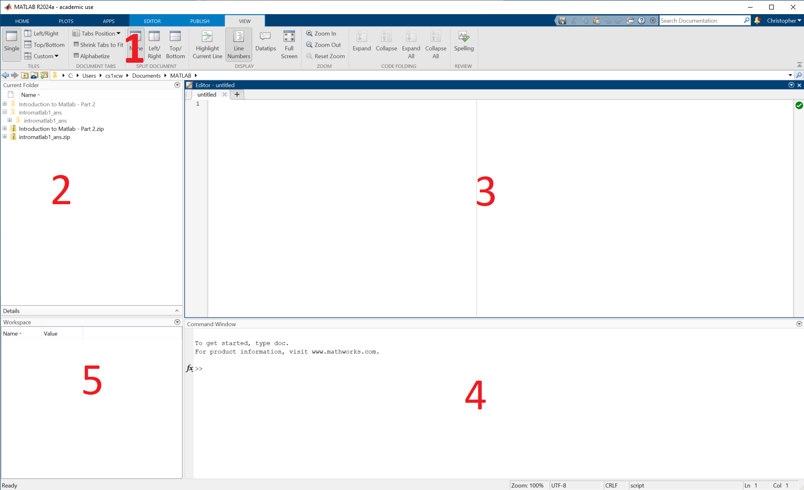

:::::::::::::::::::::::::::::::::::::: questions 

- What do all the different parts of the MATLAB interface do?
- What features are important to get started in MATLAB?

::::::::::::::::::::::::::::::::::::::::::::::::

::::::::::::::::::::::::::::::::::::: objectives

- Learn to navigate and adjust the MATLAB interface
- Understand the difference between the command window and the editor

::::::::::::::::::::::::::::::::::::::::::::::::

## Introduction

MATLAB as a language is mainly interacted with through the official MATLAB application. Before we press on with learning, writing and running MATLAB this episode will quickly run through the various parts of MATLAB and help you understand where and how you should write MATLAB.

Below is an annotated diagram what of the MATLAB application looks like.

::: callout
### Layout

Don't worry if your layout does not match the one in the diagram. The MATLAB application is very customizable and you can drag and drop the various windows around. There are a few preset layouts available in the view tab at the top 

:::

Each number on the diagram describes:

1. Menu Bar - This bar functions much like the bars at the top of many Microsoft and Google applications you may be familiar with, it has tabs with different options in. Throughout this course we will be exploring some of these tabs in more detail.
2. Explorer - Here you can explore the files on your computer much like the explorer on your computer. The folder currently showing is referred to as the 'Current Folder' or 'Working Directory', this is where MATLAB will first search for files.
3. Editor - This is where you will edit MATLAB code files
4. Command Window - One off MATLAB commands can be executed here 
5. Workspace - You will be able to see any variables that are currently in memory here

If any of this isn't clear again don't worry! This course will further explore and clarify all of these tools


{alt="A screenshot of the MATLAB application with red numbers annotating the major areas of the application which are detailed in the main body"}


## Editor VS Command Window

You can write and run MATLAB code in both the command window and the editor so understanding the purpose and differences of them is important. 

### Command Window

Starting with the command window, here you write a single line of MATLAB code, hit enter and MATLAB will run the code!

::: challenge

What is the output of this command?
```
13 * 8
```
:::

:::::::::::::::::::::::::::::::::::::::::::::::::::::::::::::::::::: instructor

Inline instructor notes can help inform instructors of timing challenges
associated with the lessons. They appear in the "Instructor View"

::::::::::::::::::::::::::::::::::::::::::::::::::::::::::::::::::::::::::::::::

::::::::::::::::::::::::::::::::::::: challenge 

## Challenge 1: Can you do it?

What is the output of this command?

```r
paste("This", "new", "lesson", "looks", "good")
```

:::::::::::::::::::::::: solution 

## Output
 
```output
[1] "This new lesson looks good"
```

:::::::::::::::::::::::::::::::::


## Challenge 2: how do you nest solutions within challenge blocks?

:::::::::::::::::::::::: solution 

You can add a line with at least three colons and a `solution` tag.

:::::::::::::::::::::::::::::::::
::::::::::::::::::::::::::::::::::::::::::::::::

## Figures

You can use pandoc markdown for static figures with the following syntax:

`{alt='alt text for
accessibility purposes'}`

{alt='Blue Carpentries hex person logo with no text.'}

## Math

One of our episodes contains $\LaTeX$ equations when describing how to create
dynamic reports with {knitr}, so we now use mathjax to describe this:

`$\alpha = \dfrac{1}{(1 - \beta)^2}$` becomes: $\alpha = \dfrac{1}{(1 - \beta)^2}$

Cool, right?

::::::::::::::::::::::::::::::::::::: keypoints 

- Use `.md` files for episodes when you want static content
- Use `.Rmd` files for episodes when you need to generate output
- Run `sandpaper::check_lesson()` to identify any issues with your lesson
- Run `sandpaper::build_lesson()` to preview your lesson locally

::::::::::::::::::::::::::::::::::::::::::::::::

